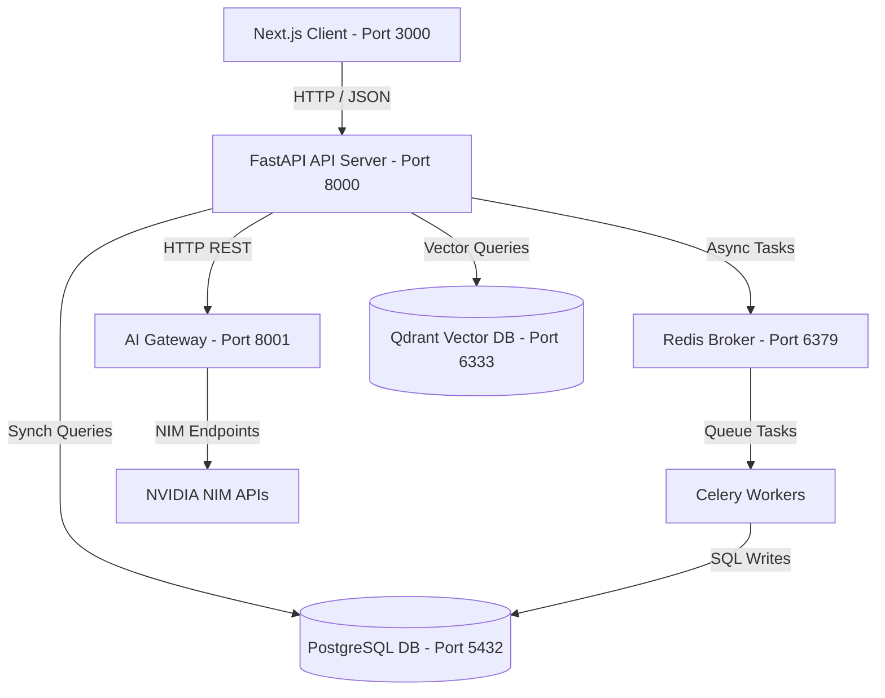

# Production Readiness Review: Career Intelligence Studio (CIS)

* **Date**: 2026-06-18
* **Authors**: Antigravity Principal Architect Agent
* **Status**: Completed Review

---

## 1. Executive Summary

This Production Readiness Review provides a deep-dive evaluation of the **Career Intelligence Studio (CIS)** monorepo, covering its architecture, security posture, scalability footprint, test coverage, AI grounding/hallucination prevention mechanisms, and SaaS migration readiness.

While the application features a modern, clean architecture utilizing **FastAPI**, **Next.js**, **LangGraph**, and **Qdrant**, several critical gaps must be addressed before launching into a production SaaS environment. The most severe issues include:
1. **Critical Security Vulnerabilities**: A hardcoded developer bypass in API authentication that lets anyone masquerade as the system admin, alongside hardcoded JWT secret defaults.
2. **Scalability Bottlenecks**: Synchronous database drivers (SQLAlchemy) executing blocks inside asynchronous FastAPI route handlers, which will lead to event-loop starvation under high request loads.
3. **Weak AI Grounding Fallbacks**: A naive lexical fallback checking mechanism in the anti-hallucination layer that can easily be bypassed by matching any single word of length > 4.
4. **Soft Tenant Isolation**: Soft metadata filtering in Qdrant instead of partition/collection-level isolation, presenting data leakage risks in a multi-tenant SaaS environment.
5. **Testing suite fragmentation**: No test suite configured for the Next.js frontend, empty root test suites, and lack of integration between monorepo tools (turbo/pnpm) and the Python backend tests.

---

## 2. Architecture Assessment

The CIS codebase is structured as a monorepo containing a FastAPI backend (`apps/api`), a Next.js frontend (`apps/web`), and a secure internal AI gateway proxy (`ai_gateway`).



### Architectural Strengths
- **Decoupled AI Gateway**: Isolates the NVIDIA NIM API consumption from the business logic API, ensuring central management of API keys, rate-limiting, and client timeouts.
- **Workflow State Machines**: LangGraph is utilized effectively to structure multi-step workflows like document processing, JD analysis, evidence retrieval, resume optimization, and interview prep. This allows logical state transitions and cleaner auditing.
- **Background Worker Model**: Decoupling file-parsing and embedding ingestion into a Celery task queue offloads heavy compute workloads from FastAPI's request-response lifecycle.

### Architectural Risks
- **Synchronous Lifecycle Management**: The HTTP client (`AIGatewayClient`) initializes its `httpx.AsyncClient` globally, but does not close it cleanly during application shutdown. This can lead to socket starvation or connection leakage.
- **SQLAlchemy DB Setup**: SQLite is used for local development, which does not support PostgreSQL-specific features like PostgreSQL RLS schemas, leading to a drift between development and production database behaviors.

---

## 3. Security Assessment

### 3.1 Authentication & Tenant Context (CRITICAL GAP)
The API route handlers use a `get_current_user` dependency in `apps/api/src/main.py`. This dependency contains a **critical developer bypass**:
```python
def get_current_user(db: Session = Depends(get_db)) -> User:
    # Simple developer bypass for ease-of-use
    dev_email = "developer@career-intelligence.studio"
    user = db.query(User).filter(User.email == dev_email).first()
    # ... auto-creates the developer user ...
    set_tenant_context(db, str(user.id))
    return user
```
This bypass completely voids authentication headers, meaning any client can call any endpoint and gain full access to the default admin tenant.

### 3.2 Hardcoded Secrets
- `JWT_SECRET` in `apps/api/src/config.py` defaults to a hardcoded string: `"super-secret-key-cis-saas-production"`.
- Database credentials in `docker-compose.yml` and default connection strings are stored in plaintext in the codebase.

### 3.3 Row-Level Security (RLS) Policy
PostgreSQL RLS policies are defined in `infra/db/schema.sql`. 
- **The RLS mechanism is solid**: All tenant-facing tables enforce `user_id = NULLIF(current_setting('app.current_user_id', true), '')::uuid`.
- **The enforcement is fragile**: SQLAlchemy runs synchronous database sessions, and the `set_tenant_context` helper executes `SET LOCAL app.current_user_id` inside transactions. Because SQLAlchemy sessions are pooled and reused, a failure to set or reset this context correctly could theoretically lead to tenant context leakage across requests if connection cleanup fails.

---

## 4. Scalability Assessment

### 4.1 Synchronous Database Bottlenecks
FastAPI runs on an asynchronous event loop. However, `apps/api/src/main.py` uses synchronous SQLAlchemy sessions:
```python
@app.get("/api/documents")
async def list_documents(
    db: Session = Depends(get_db),
    user: User = Depends(get_current_user)
):
    docs = db.query(Document).filter(Document.user_id == user.id).all() # Sync database block!
```
When multiple concurrent requests query the database, SQLAlchemy blocks the single-threaded FastAPI event loop. This leads to latency spikes and degrades throughput, negating the scaling benefits of FastAPI.

### 4.2 Resource Allocation and Connection Pooling
- **RDS Database**: The database is provisioned in Terraform as a single `db.t4g.micro` database with no read-replicas. This is insufficient for handling dense JSONB queries and large PDF parsing.
- **Qdrant Vector DB**: Provisioned as a single ECS task with only 512 CPU units and 1GB RAM. Indexing and querying 1024-dimension vectors (`nvidia/embeddings-nv-embed-qa-4`) will result in high memory consumption and Out-Of-Memory (OOM) crashes under moderate document ingestion loads.

### 4.3 Task Queue scaling
Celery workers run with standard threading, but file processing (`docx`, `pdf`) is CPU-intensive. Running a single worker without horizontal auto-scaling or multi-process concurrency will cause a backlog in document parsing.

---

## 5. Testing Coverage Assessment

The testing suite shows significant gaps between the backend and frontend modules:

| Module | Test Framework | Status / Coverage | Critical Gaps |
| :--- | :--- | :--- | :--- |
| **Backend API** | Pytest | 31 tests passing | High mock coverage, but lack of integration tests against a real PostgreSQL/Qdrant instance. |
| **Web Client** | None | 0% | No unit tests, no visual regression, and no E2E tests configured. |
| **Integration Suite**| Pytest | Empty root `tests/` | The root level integration and E2E directories are completely empty. |

### Tooling Disconnect
The turborepo config `turbo.json` maps the root `test` script to workspace package test scripts. Because `apps/api` has no `package.json` (managed via Poetry/Python), running `pnpm test` at the root does not trigger the backend Python tests, meaning tests are excluded from the main monorepo pipeline.

---

## 6. AI Grounding & Hallucination Prevention

The application relies on evidence grounding and validation check nodes within LangGraph workflows (specifically for resume optimization and cover letter generation).

### 6.1 Cosine Similarity Grounding
The semantic validation checks sentences using cosine similarity with a threshold of `0.80` against user-selected or retrieved evidence chunks. This approach is highly effective in ensuring semantic alignment.

### 6.2 Lexical Fallback Loophole (CRITICAL GAP)
If embedding generation fails, or during offline mock execution, the validator falls back to a lexical overlap check in `apps/api/src/graph/resume_optimization.py`:
```python
for b in bullets:
    matched = any(any(word in ev.lower() for word in b.lower().split() if len(word) > 4) for ev in evidence_texts)
```
This loop checks if **any single word** of length greater than 4 in the generated bullet point matches **any word** in the evidence text.
- **Vulnerability**: A generated claim like `"Engineered a massive **kubernetes** cluster from scratch"` will be marked as "validated" against an unrelated evidence chunk containing the sentence `"I once read a book about **kubernetes**"`. This allows hallucinations to slip past the validation layer.

### 6.3 Missing Grounding in Workflows
The mock interview feedback loop (`apps/api/src/graph/interview_prep.py`) does not run automated semantic grounding checks on the candidate's responses. It feeds the response directly to the LLM system prompt without strict similarity checks, creating a gap in factual grading.

---

## 7. SaaS Migration Readiness

Migrating the application to a production SaaS product requires resolving several design issues:

1. **Soft Tenant Isolation in Vector Database**: 
   Qdrant uses a single collection `career_chunks` and relies on payload filtering:
   ```python
   qdrant_models.FieldCondition(key="user_id", match=qdrant_models.MatchValue(value=str(uid)))
   ```
   If a query filter is omitted in code, a tenant can query and retrieve vector embeddings belonging to other tenants. A more secure approach is required (e.g. Qdrant Namespaces or tenant-specific collections).
2. **Missing Billing / Subscription Hooks**:
   There is no subscription status check in route handlers or middlewares to restrict access based on pricing tiers.
3. **No Tenant Provisioning Flow**:
   User registration does not automatically set up default templates or workspace folders in a scalable, isolated storage bucket (e.g. AWS S3). Files are currently written to local disk paths (`c:/Users/rajaj/Projects/.../data/uploads`).

---

## 8. Remediation Strategy Summary

To reach production-grade status, the architecture must transition from local development mocks to secure cloud-native constructs:

1. **Implement JWT Authentication**: Replace the dev bypass with a secure JWT authentication middleware decoding tokens from an Identity Provider (e.g. Cognito, Auth0, or custom JWT handler).
2. **Asynchronous Database Sessions**: Transition SQLAlchemy to use `asyncio` (`create_async_engine`, `AsyncSession`).
3. **Tighten AI Grounding Validator**: Replace the simple lexical fallback checker with a multi-keyword token matching algorithm (e.g., BM25) or a semantic threshold fallback using locally-hosted light models (e.g., SentenceTransformers).
4. **Upgrade Qdrant Isolation**: Use Qdrant tenant namespaces or separate collections.
5. **Standardize CI/CD Tests**: Configure Next.js testing (Vitest/Playwright) and configure a root task runner that runs both pnpm (Next.js) and poetry (FastAPI) tests.
