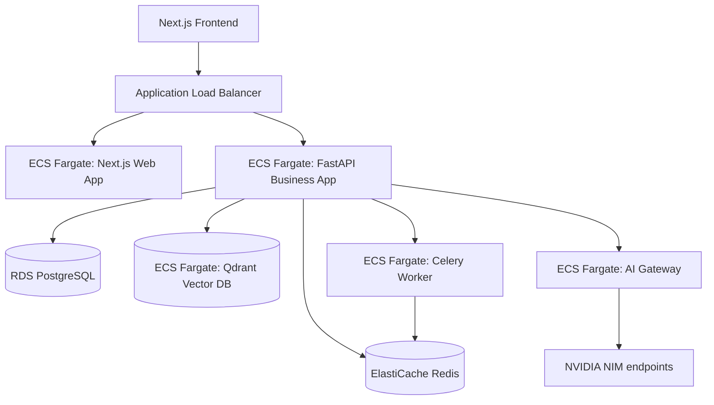

# Production Deployment Runbook - Career Intelligence Studio

This runbook outlines the steps to deploy the Career Intelligence Studio (CIS) platform to AWS in a production environment.

---

## Architecture Overview



---

## Infrastructure Provisioning (Terraform)

AWS infrastructure is defined inside [main.tf](file:///c:/Users/rajaj/Projects/CV%20and%20Interview%20Prep%2520Builder/infra/terraform/main.tf).

### 1. Initialize Terraform
Navigate to the terraform directory:
```bash
cd infra/terraform
terraform init
```

### 2. Verify Plans
Validate variables and execution resources:
```bash
terraform plan -out=tfplan.binary
```

### 3. Apply Resources
Deploy the AWS Virtual Private Cloud, PostgreSQL RDS database, ElastiCache Redis replication group, and ECS container services:
```bash
terraform apply tfplan.binary
```

---

## Database Migrations (Alembic)

After database provisioning, run schema updates.

### 1. Configure Connection URL
Set the target connection database environment variable:
```bash
export DATABASE_URL="postgresql://<rds_username>:<rds_password>@<rds_endpoint>:5432/career_intelligence_studio"
```

### 2. Apply Migrations
Alembic will automatically execute baseline tables and policies:
```bash
cd apps/api
alembic upgrade head
```

---

## Docker Orchestration

For local testing or EC2 container setups, the platform uses Docker Compose.

### Build and Launch Services
Verify environment variables are set in `.env` (using `.env.example` as a template), then spin up the stack:
```bash
docker compose -f infra/docker/docker-compose.yml up -d --build
```

### Health Check Verification
Inspect running container states:
```bash
docker compose -f infra/docker/docker-compose.yml ps
```

---

## Observability & Monitoring

The stack includes OpenTelemetry, Prometheus, and Grafana for metrics visualization.

### Prometheus Dashboard
Access metrics at `http://localhost:9090`. Scrapes target workloads:
- `api-service` (port 8000)
- `ai-gateway` (port 8001)

### Grafana Dashboard
Access visual graphs at `http://localhost:3000` (default login: `admin/admin`). Configure Prometheus as a datasource and import standard panels tracking:
- Retrieval Latencies
- LLM Generation Latencies
- Token Budgets
- Hallucination Rates
