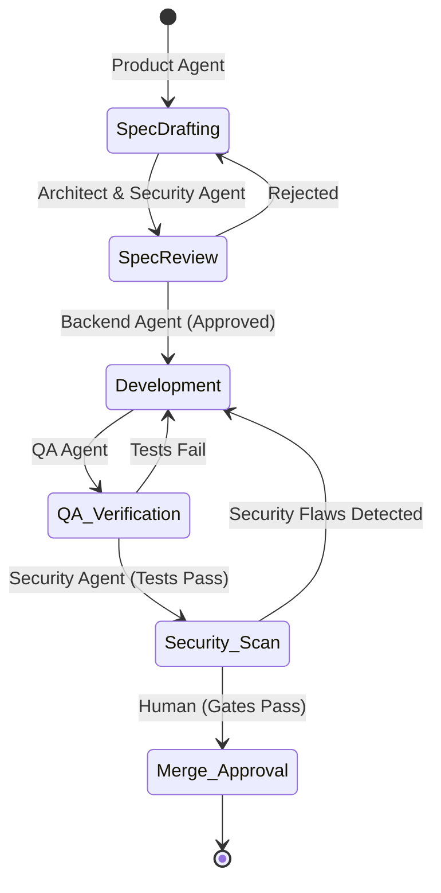

# Agent Orchestration Guide & Rules

This document outlines the state flow, retry configurations, state propagation, and recovery workflows governing all autonomous agents within the AI-EOS.

## 1. Orchestration State Model (LangGraph-style)

## 2. Retry and Failure Policies
* **Max Retries**: An agent is allowed a maximum of 2 self-correction execution cycles per subtask.
* **Escalation**: On the 3rd consecutive execution failure, the agent MUST immediately stop execution, write a detailed diagnostics report, and notify a human administrator.
* **Deadlock Resolution**: If Agent A is waiting for Agent B, and Agent B is blocked by Agent A, the orchestrator interrupts after 5 minutes and rolls back the active state to the last verified commit.

## 3. Communication Protocols
* Agents communicate asynchronously via git commits and pull request events.
* State metadata is propagated via structured file payloads in the `/memory` directory.
